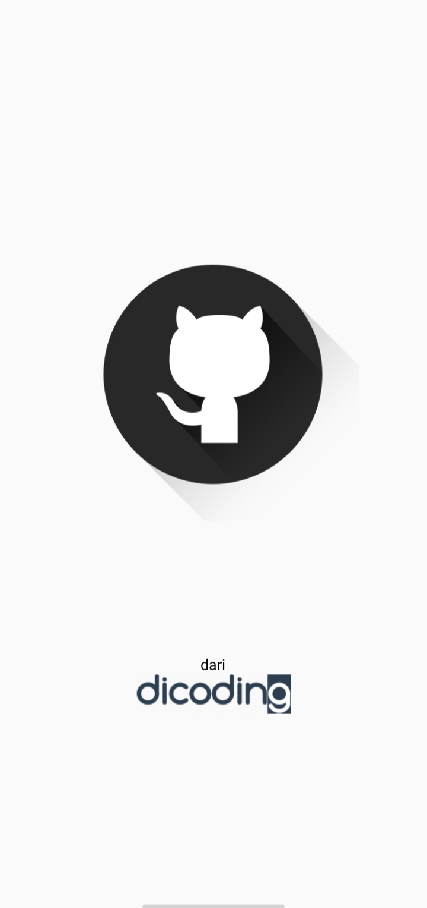
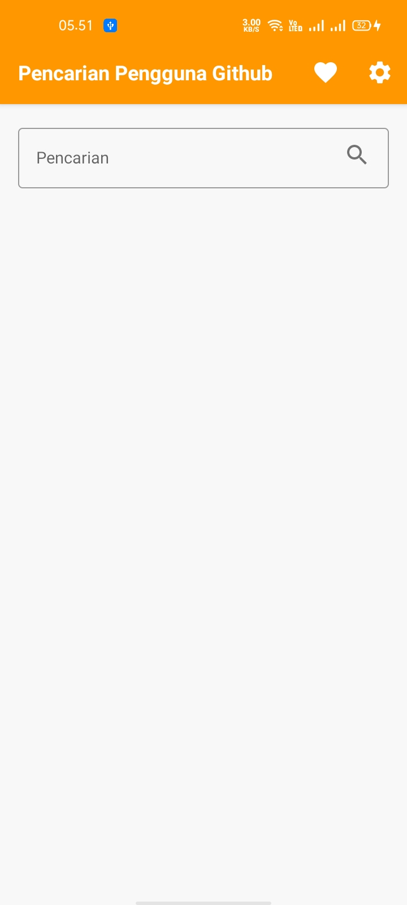
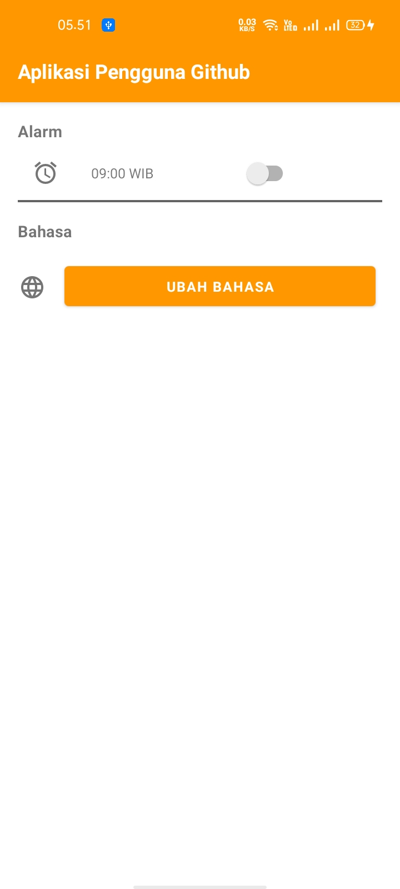

# GithubUserApp
### Belajar Fundamental Aplikasi Android dari Dicoding

Aplikasi Github User App merupakan project akhir untuk memenuhi submission terakhir atau submission 3 dari kelas BFAA dicoding.

### Project ini menerapkan
- Parcelable
- RecyclerView
- SearchView
- Detail User
- Localization
- Favorite
- Consumer App
- Alarm Manager
- Notification
- API Github
- Retrofit
- CRUD

## Logo

## Preview App

